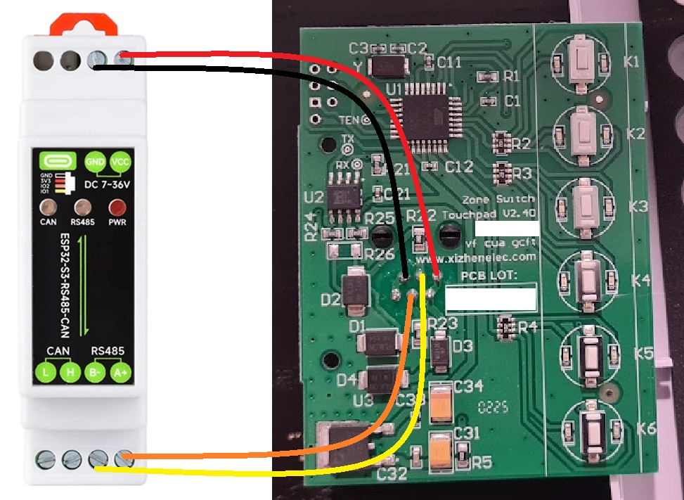
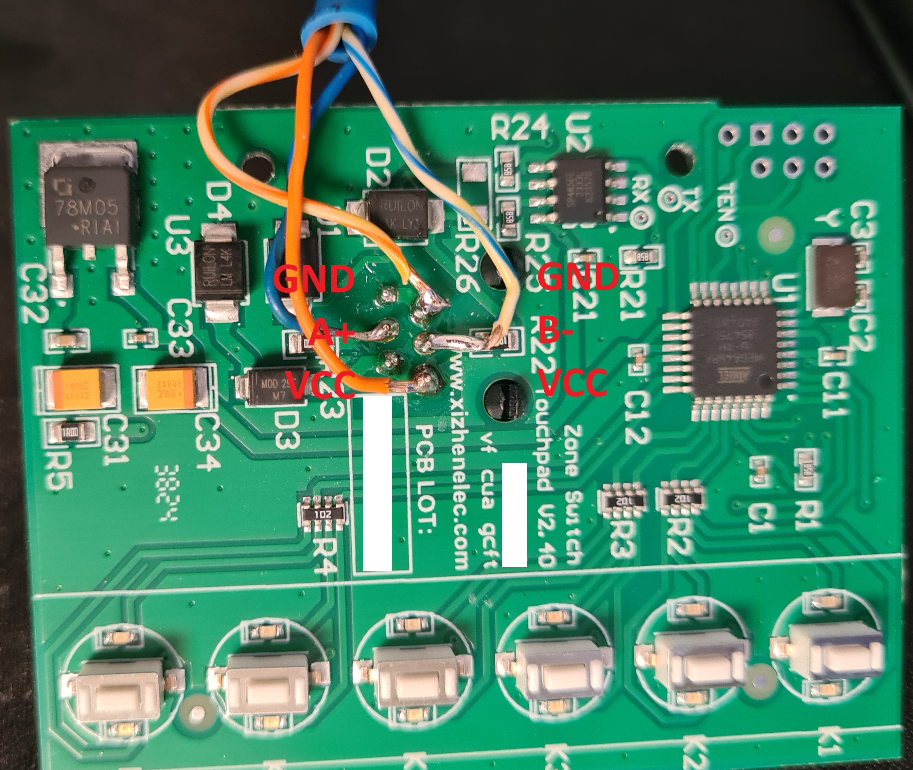
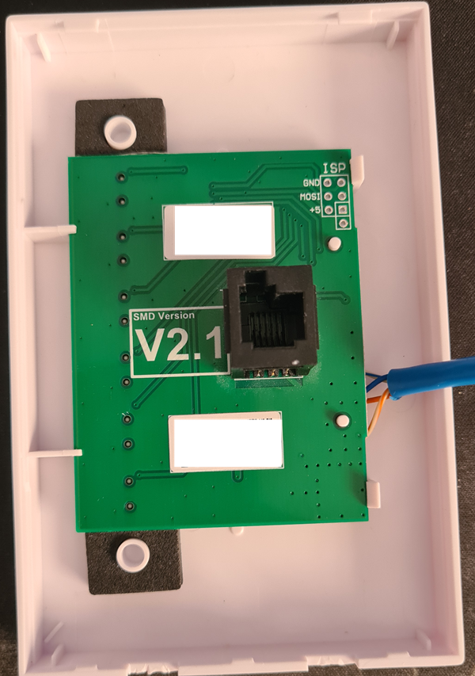
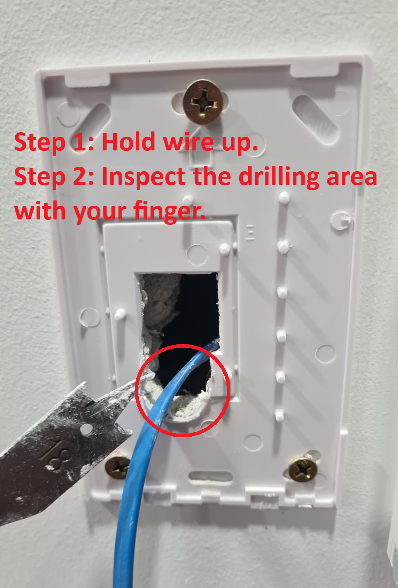
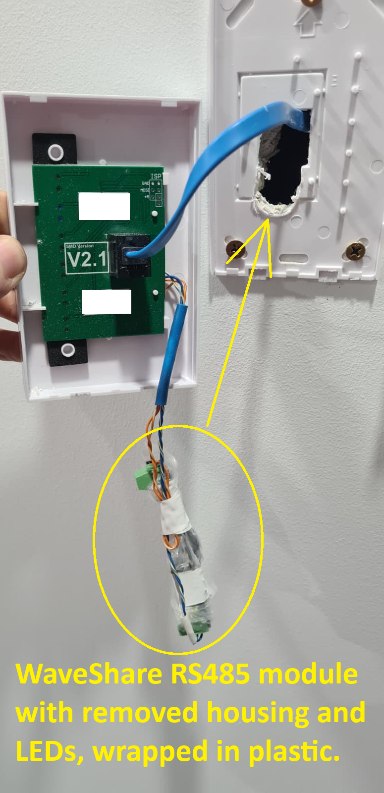

# ZoneSwitch Reverse Engineering Workspace

Research and tooling for decoding the Polyaire ZoneSwitch V2 touchpad/main-module protocol and building an ESPHome integration.

## Hardware & ESPHome setup
- Module used: ESP32-S3-RS485-CAN https://www.aliexpress.com/item/1005010428752299.html
> **_NOTE:_** In theory any ESP32 and RS485 modules can be used as long as you make relevent changes to the yaml.

### Wiring diagram:


### Connector Labels:


### Back side of the panel, ready to wire the module


### Drill to the mounting bracket to slide in the module


### Final look


### ESPHome quick start:
```yaml
esphome:
  name: ws-esp32s3-02
  friendly_name: ws esp32s3 02
  platformio_options:
    board_build.flash_mode: dio

esp32:
  board: esp32-s3-devkitc-1
  framework:
    type: arduino
  flash_size: 16MB

# Disable logging
logger:
  baud_rate: 0   # IMPORTANT (UART conflict prevention)

external_components:
  - source:
      type: git
      url: https://github.com/jourdant/esphome-zoneswitch
      ref: main
    components: [ "zoneswitch" ]
    refresh: 0s

uart:
  - id: zoneswitch_uart
    tx_pin: GPIO17
    rx_pin: GPIO18
    baud_rate: 9600
    data_bits: 8
    parity: NONE
    stop_bits: 1
    flow_control_pin: GPIO21

zoneswitch:
  - id: zs_bus
    uart_id: zoneswitch_uart
    debug: false
    enable_polling: true
    poll_interval: 1s
    offline_miss_threshold: 5
    # Set to 1..6 if the controller has a known hardware spill zone.
    spill_zone: 0

switch:
  - platform: zoneswitch
    id: zone_1_switch
    zoneswitch_id: zs_bus
    zone: 1
    name: "ZoneSwitch Zone 1"
    icon: mdi:air-filter

  - platform: zoneswitch
    id: zone_2_switch
    zoneswitch_id: zs_bus
    zone: 2
    name: "ZoneSwitch Zone 2"
    icon: mdi:air-filter

  - platform: zoneswitch
    id: zone_3_switch
    zoneswitch_id: zs_bus
    zone: 3
    name: "ZoneSwitch Zone 3"
    icon: mdi:air-filter

  - platform: zoneswitch
    id: zone_4_switch
    zoneswitch_id: zs_bus
    zone: 4
    name: "ZoneSwitch Zone 4"
    icon: mdi:air-filter

  - platform: zoneswitch
    id: zone_5_switch
    zoneswitch_id: zs_bus
    zone: 5
    name: "ZoneSwitch Zone 5"
    icon: mdi:air-filter

  - platform: zoneswitch
    id: zone_6_switch
    zoneswitch_id: zs_bus
    zone: 6
    name: "ZoneSwitch Zone 6"
    icon: mdi:air-filter

sensor:
  - platform: zoneswitch
    id: zoneswitch_node_address
    zoneswitch_id: zs_bus
    metric: node_address
    name: "ZoneSwitch Node Address"
    icon: mdi:identifier

  - platform: zoneswitch
    id: zoneswitch_rx_ok
    zoneswitch_id: zs_bus
    metric: rx_ok
    name: "ZoneSwitch RX OK"
    icon: mdi:counter

  - platform: zoneswitch
    id: zoneswitch_rx_bad
    zoneswitch_id: zs_bus
    metric: rx_bad
    name: "ZoneSwitch RX Bad"
    icon: mdi:counter

binary_sensor:
  - platform: zoneswitch
    id: zoneswitch_online_status
    zoneswitch_id: zs_bus
    metric: online
    name: "ZoneSwitch Gateway Online"
    icon: mdi:lan-connect
```

## Project goals

- Decode RS485 packet format between ZoneSwitch touchpad and main control module
- Extract install/wiring details from vendor documentation and photos
- Build an ESPHome path to:
  - publish per-zone status (Z1..Z6)
  - eventually switch zones on/off
  - emulate a second touchpad on T2

## Current status

- Captured idle bus traffic is available and parsed.
- Draft protocol spec created and updated with validated request/response semantics.
- Touchpad2 emulation plan created (staged passive -> active approach).
- External ESPHome component scaffolded (`zoneswitch`) with assignable zone entities.
- External ESPHome component now supports both per-zone status and per-zone switch control.
- Read-only ESPHome example created for zone mask decoding.
- RS485/ESPHome best-practices research consolidated and applied.
- Azure Document Intelligence script added for reusable PDF/image OCR to Markdown.

## Key files

- Research captures and OCR output:
  - `docs/research/saved_rs485_packets.md`
  - `docs/research/saved_rs485_packets2.md`
  - `docs/research/ZoneSwitchV2_OpInstallationManual2015_12x17.md`
  - `docs/research/screenshot_ocr.md`
- Reverse-engineering outputs:
  - `docs/specs/polyaire_zoneswitch_protocol_spec_draft.md`
  - `docs/specs/esphome_zoneswitch_touchpad2_plan.md`
  - `docs/research/rs485_esphome_best_practices.md`
- ESPHome starter templates:
  - `esphome/esphome_zoneswitch_example_readonly.yaml`
  - `esphome/esphome_zoneswitch_example_readwrite.yaml`
  - `esphome/esphome_zoneswitch_component_example.yaml`
- External component source:
  - `esphome/components/zoneswitch/`
- OCR tooling:
  - `tools/azure_docint_to_markdown.py`
  - `tools/README.md`

## Protocol notes (snapshot)

From current captures:

- Fixed 9-byte framing with `AA` start and `55` end
- Request/response pair structure is consistent
- Sequence byte is mirrored in response
- Response payload includes a validated 6-bit zone mask
- Checksum is validated as CRC-8/MAXIM over bytes `[1..6]`
- Component-generated idle poll frames in `saved_rs485_packets3.md` also match
  the checksum model. That capture predates the auto-detection PR, so its
  `Node Address = 0` diagnostic should be retested; with auto-detection enabled,
  valid discovered traffic should update the learned node address.

See the draft spec for exact byte-level detail and confidence labels.

The `esphome/esphome_zoneswitch_example_readwrite.yaml` file includes passive
decode and write controls with protocol-valid framing and checksum (CRC-8/MAXIM).

## ESPHome external component usage

Use the new component to assign one or more zones and publish/control them as entities:

```yaml
external_components:
  - source:
      type: git
      url: https://github.com/jourdant/esphome-zoneswitch
      ref: main
    components: [ "zoneswitch" ]

uart:
  - id: zoneswitch_uart
    rx_pin: GPIO03
    tx_pin: GPIO04
    baud_rate: 9600

zoneswitch:
  - id: zs_bus
    uart_id: zoneswitch_uart
    poll_interval: 5s
    offline_miss_threshold: 5
    # Optional: set to 1..6 if your controller has a known spill zone.
    spill_zone: 0

switch:
  - platform: zoneswitch
    id: zone_1_switch
    zoneswitch_id: zs_bus
    zone: 1
    name: "Zone 1"
    icon: mdi:air-filter

  - platform: zoneswitch
    id: zone_2_switch
    zoneswitch_id: zs_bus
    zone: 2
    name: "Zone 2"
    icon: mdi:air-filter
```

For a complete example with all 6 zones, see
`esphome/esphome_zoneswitch_component_example.yaml`.

The component validates CRC-8/MAXIM on received frames, learns the session-scoped
node address from valid status responses, exposes optional RX diagnostic counters
(`metric: rx_ok` and `metric: rx_bad`), and suppresses repeated toggle writes
until a fresh status frame confirms current hardware state.

`tx_node_addr` is only a pre-learn fallback hint. Set it to `0` only for passive
learning from existing touchpad traffic, because active polls are skipped until a
valid response teaches the runtime node address.

## Next recommended capture set

To harden write behavior and edge-case handling further, collect button-action captures:

- Active ESPHome TX with the auto-detection PR applied, confirming the learned
  node address updates and controller status responses are decoded
- Press each zone once (then again)
- Long-press spill-zone setting action
- Touchpad-off combo (Z3 + Z4)
- Capture with spill DIP OFF and ON

These traces should allow command opcode and checksum resolution.
