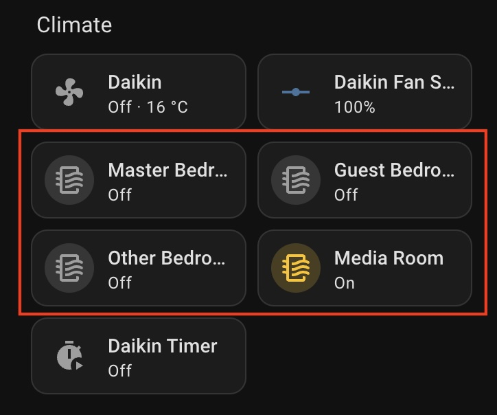
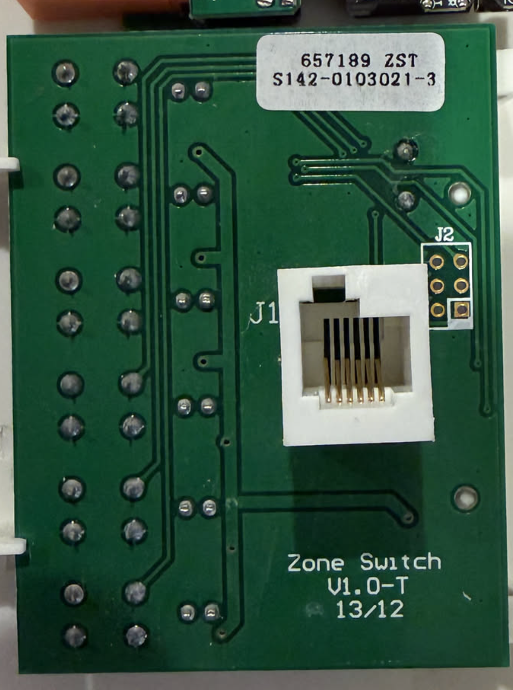
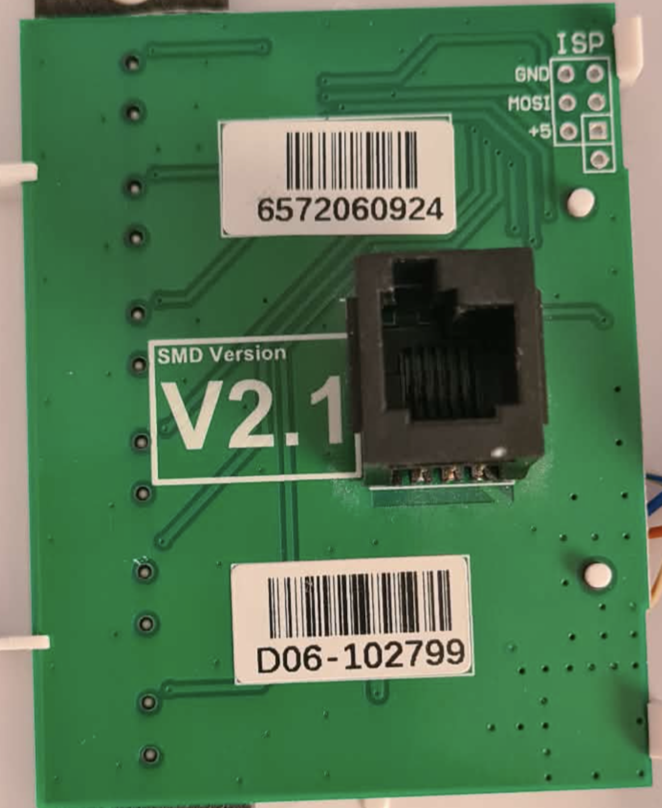

# ESPHome ZoneSwitch

Connect a Polyaire ZoneSwitch controller to Home Assistant through RS485.
**V2 is the default and is confirmed fully working on V2.1 hardware.**
V1 supports software control on V1.0-T hardware, with a known wall-panel limitation.

  

*Example Home Assistant dashboard. The four tiles highlighted in red are the
ZoneSwitch zone controls, with room names configured for this installation.*

## Identify your wall controller

Read the revision printed on the **back of the wall PCB**. These are the two
revisions identified and tested so far; socket appearance alone is not identification.

| V1.0-T | V2.1 |
|:---:|:---:|
|  |  |
| Marking: **Zone Switch V1.0-T** | Marking: **SMD Version V2.1** |
| `protocol: v1` · **250000 baud** | `protocol: v2` · **9600 baud** |
| Experimental: software control works; wall LEDs can stay stale and buttons can temporarily stop responding after external traffic | **Confirmed fully working**; selected when `protocol` is omitted |
| **[V1.0-T setup guide →](docs/guides/v1.0-t.md)** | **[V2.1 setup guide →](docs/guides/v2.1.md)** |

For a different or unreadable marking, collect the PCB revision and a passive
capture before choosing a protocol. A matching connector does not establish its pinout.

## Start here

1. Open the guide for your revision above and check the hardware connections.
2. Select its YAML example, enter your own GPIOs and use `!secret` for credentials.
3. Begin with `listen_only: true`, press physical buttons and confirm received states.
4. Enable control once passive reception works. The V1 guide explains its limitations.

Only expose zones installed in your system. Home Assistant switches report
received controller state; they do not measure airflow.

## Documentation

| Looking for… | Start here |
|---|---|
| UART settings, entities, listen-only mode and diagnostics | [Configuration reference](docs/configuration.md) |
| A complete device config or a fragment to merge | [Examples](esphome/examples/README.md) |
| Packet formats, timing and evidence | [Protocol specifications](docs/specs/protocols/README.md) |
| Original logs, manuals and normalized captures | [Research and captures](docs/research/README.md) |
| Component boundaries and transport design | [Architecture](docs/architecture.md) |
| Reproducing software checks | [Tests](tests/README.md) |
| Contributing, reporting a problem or releasing | [Contributing](CONTRIBUTING.md) · [Changelog](CHANGELOG.md) |

Protocol support and release status are separate: V2 is confirmed on hardware,
while changes on a development branch still need release validation.
Pin a tested commit or published release tag for an installation. This refactor's
software checks are recorded in the [validation log](docs/research/validation/2026-09-17.md).

## Acknowledgements

A big thanks to everyone who has participated in getting the project to where it is.
Here's a list of contributors in no particular order.

- [@jourdant](https://github.com/jourdant)
- [@ashish-khokhar](https://github.com/ashish-khokhar)
