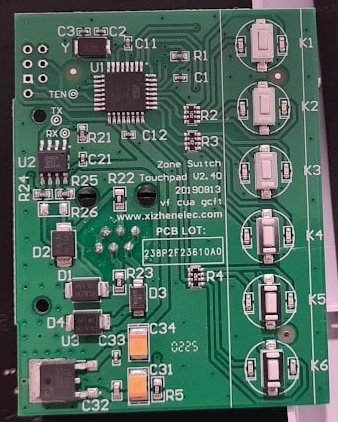
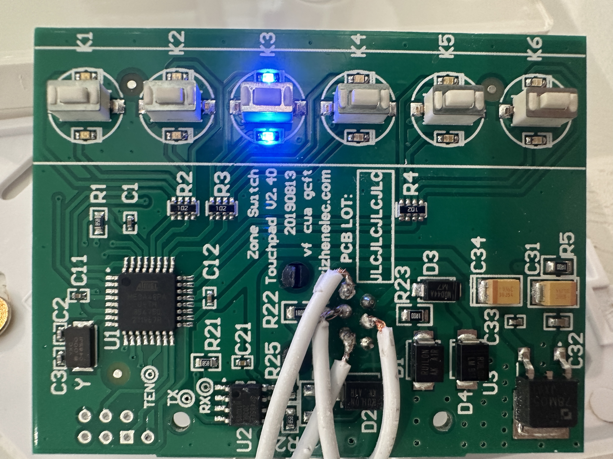
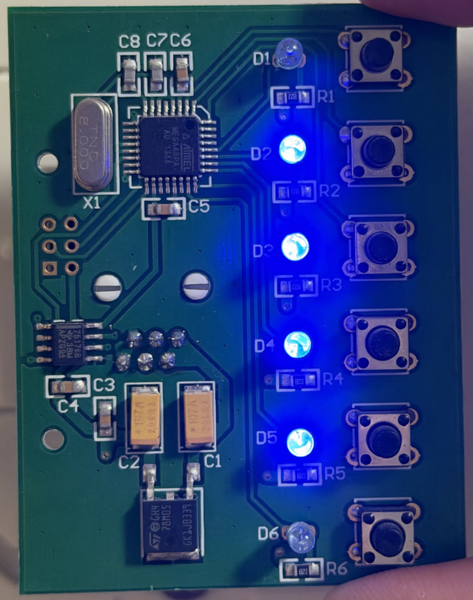
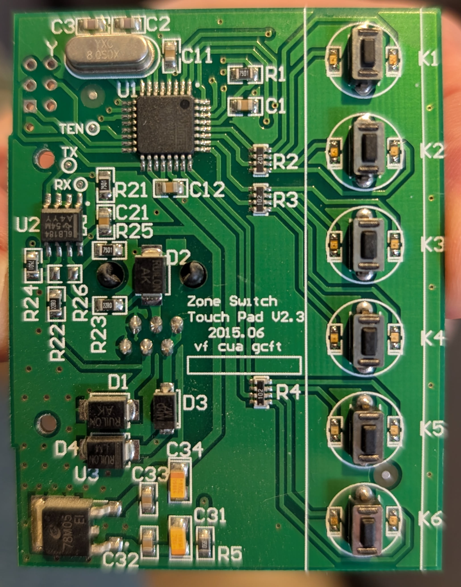
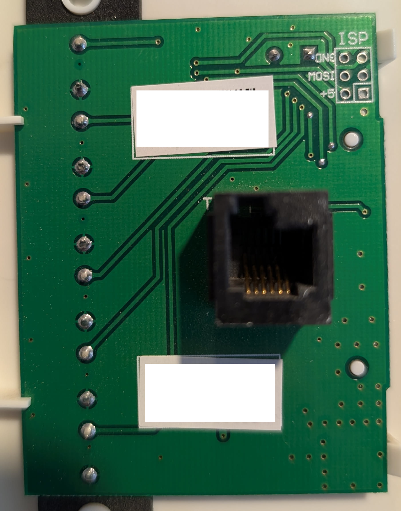

# Board identification and compatibility

Identify your wall controller using the markings on both sides of its PCB.
**Front** means the LED/button side; **back** means the RJ12 connector side.

PCB version markings can differ between the front and back of the same board.
Record both when identifying your hardware. Protocol compatibility below reflects
tested boards; printed version numbers and dates alone do not establish compatibility.
Each row records a contributor's reported board, not necessarily a distinct revision.
Confirmed boards are grouped by protocol; boards awaiting testing are listed separately.

## Protocol V2 — 9600 baud

**Confirmed fully working; the component's default protocol.**
Follow the [V2 setup guide](../guides/v2.1.md).

| Front (LEDs) | Back (RJ12) | PCB markings | Printed date / installation | Confirmed by |
|---|---|---|---|---|
|  |  | Front: **Zone Switch Touchpad V2.40** Back: **SMD Version V2.1** | `20190813` (13 August 2019); meaning unconfirmed. Installation unknown. | [@ashish-khokhar](https://github.com/ashish-khokhar) |
|  | Not yet available | Front: **Zone Switch Touchpad V2.40** Back: **Unconfirmed** | `20190813` (13 August 2019); meaning unconfirmed. Installation unknown. | [@threeseed](https://github.com/threeseed) · [Photo](https://github.com/jourdant/esphome-zoneswitch/issues/8#issuecomment-5706901948) · [Working configuration](https://github.com/jourdant/esphome-zoneswitch/issues/8#issuecomment-5018118560) |

Ashish's board carries both **V2.40 on the front** and **V2.1 on the back**.
These markings therefore do not necessarily identify different hardware models.
Threeseed's front photo has the same version and date markings, but its rear
marking has not yet been photographed.

The repeated `20190813` beside the printed version may be a design/revision date.
That is an inference from the photographs, not a confirmed manufacturing date or
an explanation of what each version number represents.

## Protocol V1 — 250000 baud

**Experimental support:** software control works, but external commands can leave
wall-controller LEDs out of sync and temporarily make physical buttons unresponsive.
Follow the [V1.0-T setup guide](../guides/v1.0-t.md).

| Front (LEDs) | Back (RJ12) | PCB markings | Printed date / installation | Confirmed by |
|---|---|---|---|---|
|  |  | Front: **No version marking visible** Back: **Zone Switch V1.0-T** | `13/12` (date format unconfirmed); installed in **2014**, as reported by the owner. | [@jourdant](https://github.com/jourdant) |

## Awaiting protocol confirmation

These photographs identify hardware, but do not yet establish ESPHome compatibility.

| Front (LEDs) | Back (RJ12) | PCB markings | Printed date / installation | Contributed by |
|---|---|---|---|---|
|  |  | Front: **Zone Switch Touch Pad V2.3** Back: **No version marking visible** | `2015.06` (June 2015); meaning unconfirmed. Installation unknown. | [@mattaustin](https://github.com/mattaustin) · [Photos and report](https://github.com/jourdant/esphome-zoneswitch/issues/8#issuecomment-5710688310) |

At the time of the report, @mattaustin had not connected an ESPHome adapter and was
gathering components. The [maintainer's reply](https://github.com/jourdant/esphome-zoneswitch/issues/8#issuecomment-5710800326)
suggests V2 as the expected protocol, but neither the protocol nor its baud rate
has been confirmed on this board. Its printed date is not a verified manufacturing
or installation date. The front and back photos are the contributor's original
second and first attachments respectively; existing label redactions are preserved.

## Contribute a compatibility report

Include clear photos of both PCB sides, all printed version/date markings, the
approximate installation year if known, and the protocol/UART settings that worked.
Describe whether software control, physical buttons and wall LEDs all work normally.
An unknown marking or similar connector alone is not a confirmed match.
See the [hardware notes](README.md) for wiring checks and
[contributing guide](../../CONTRIBUTING.md) for reporting details.
