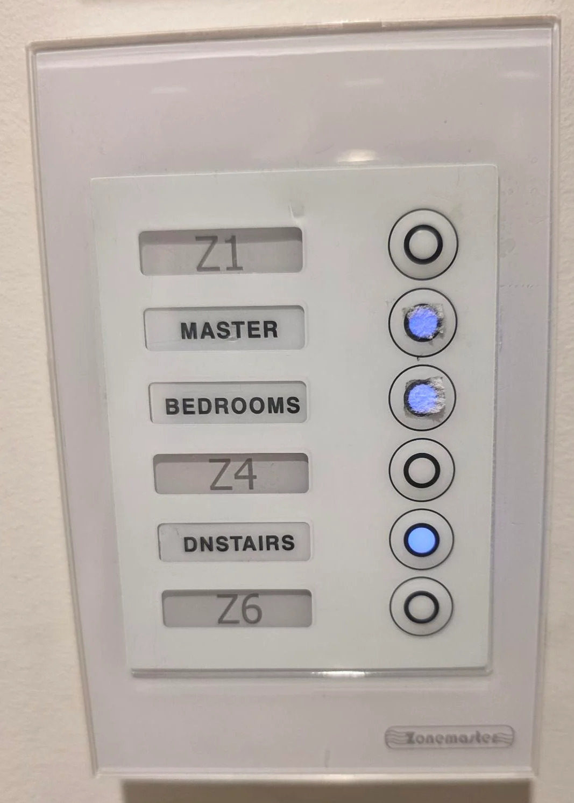
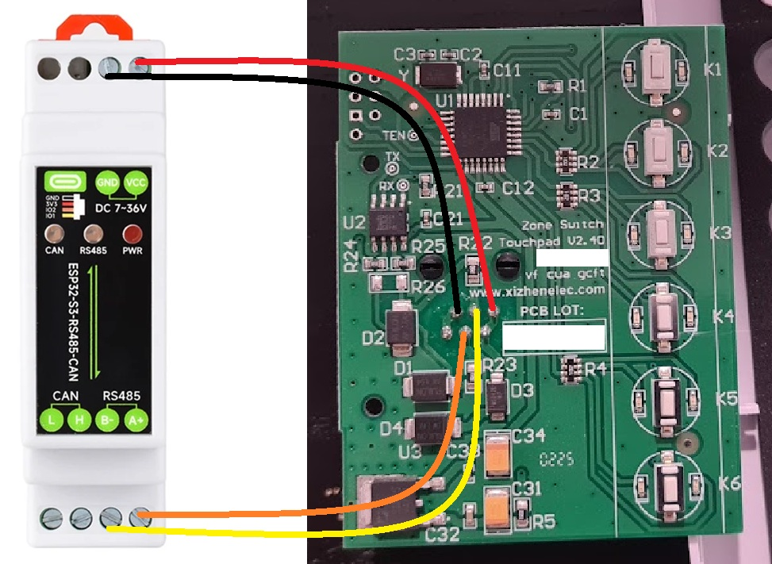
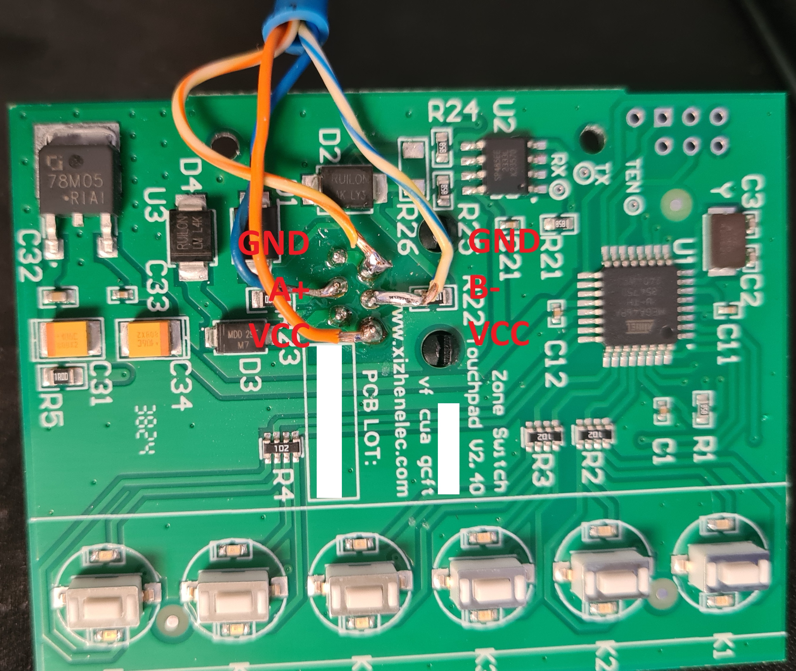
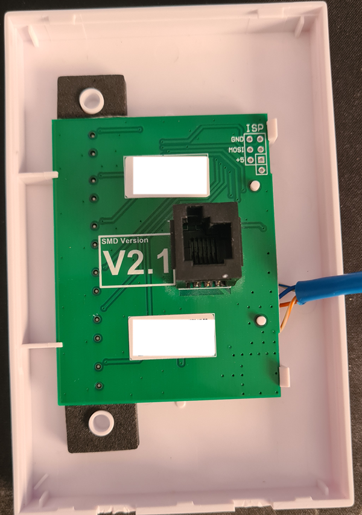
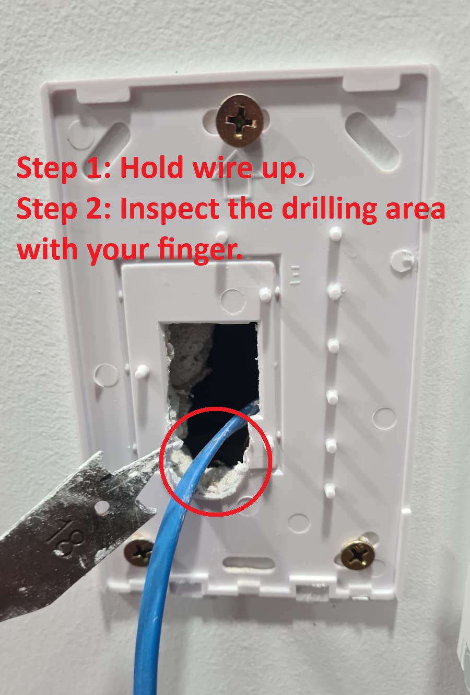
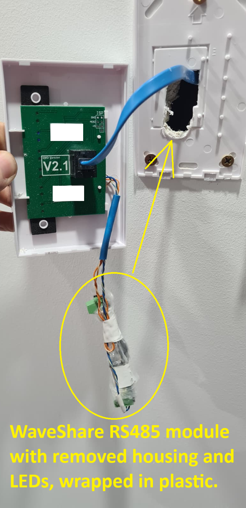

# V2.1 installation photographs

These photographs document the tested V2 setup. Do not infer the connector
orientation of another board revision from matching wire colours or housing.
The original setup uses an ESP32-S3-RS485-CAN module; GPIO assignments differ
from the XIAO carrier in the V1 example.

